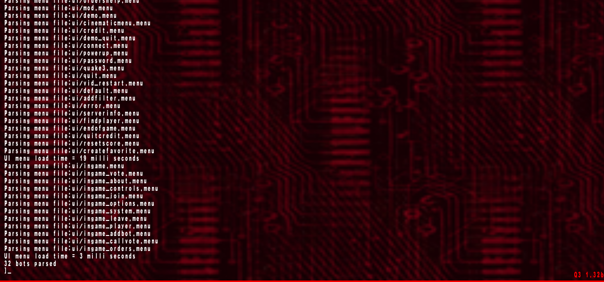
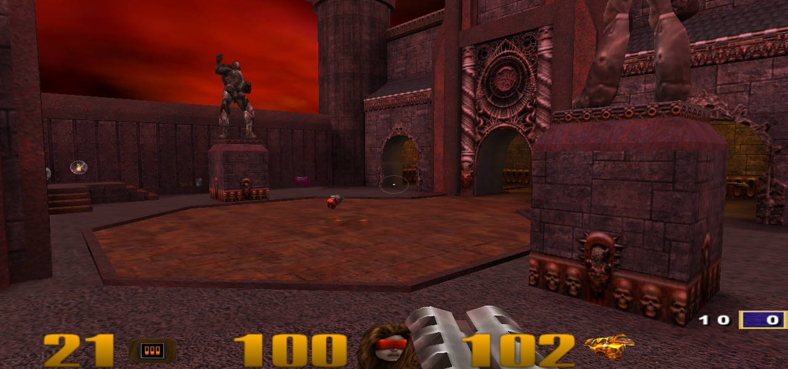

# Overboost Engine

An id Tech 3 derived game engine

## Building

Currently buildable on Windows using CMake and MinGW (v9.2.0 to be specific, but a lower version will also be fine as long as it supports C11 and C++17 standards). Only Debug version is buildable at the moment

## Installation and Running

You need to have the original Quake 3 assets in order to playtest the thing. You can get them from Steam or your CD copy if you still have it

Put the assets and compiled binaries in a single folder and remove the 'lib' prefix from each dll name. Rename the cgame dll to cgamex86, game to qagamex86 and ui to uix86. Copy the 'Quake-III-Arena-master/ui' folder and place it under the 'baseq3/' dir and you should be able to successfully launch the app after that

You also need to set the sv_pure, vm_ui, vm_game and vm_cgame cvars values to 0 in order to make everything work correctly. You can do that inside the 'baseq3/q3config.cfg' file (the sv_pure entry might be absent so you need to manually add it in that case)

## Screenshots

## License

GPLv2 (for now)